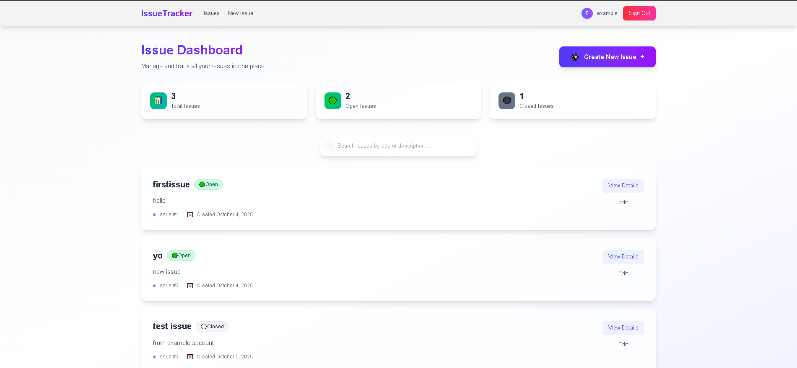
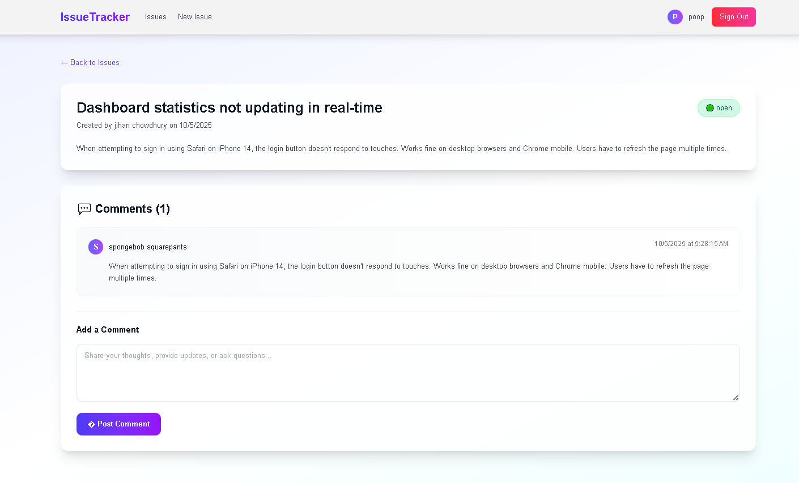

# Issue Tracker

A full-stack ## Features

- **Authentication System** - User registration and login with NextAuth.js and secure password hashing
- **Issue Management** - Create, view, and manage issues with full CRUD operations  
- **Comments System** - Discussion threads on individual issues with user attribution
- **Search Functionality** - Real-time issue search with debouncing for better performance
- **Type-Safe Database** - Drizzle ORM with PostgreSQL for reliable data operations
- **Performance Optimization** - Strategic caching for improved load times
- **Protected Routes** - Authentication-required pages with session management
- **Modern UI** - Responsive design with gradient styling and smooth animations
- **Security** - Bcrypt password hashing and JWT session managementing application built with Next.js 15, TypeScript, and PostgreSQL. Features user authentication, issue management, and real-time search functionality.

**Live Demo**: [Deployed on Vercel](https://your-app-url.vercel.app)

## ScreenshotsaS Issue Tracker

A modern, full-stack SaaS-style issue tracking application built with cutting-edge technologies. Features authentication, real-time data management, and optimized performance through strategic caching.

**🌐 Live Demo**: [Deployed on Vercel](https://your-app-url.vercel.app)

## � Screenshots

### Issue Dashboard

*Modern issue management dashboard with gradient design and real-time statistics*

### Individual Issue & Comments  

*Detailed issue view with collaborative comment system and user interactions*

### Search Functionality
  
*Real-time search with debounced filtering and intelligent results*

### Authentication

*Secure authentication interface with modern gradient styling*

## �🚀 Key Features

- **🔐 Secure Authentication** - Complete user registration and login system with NextAuth.js
- **📊 Issue Management Dashboard** - Create, view, and manage issues with intuitive CRUD operations  
- **� Comments System** - Full discussion threads on individual issues with user attribution
- **🔍 Smart Search** - Real-time issue search with debouncing and intelligent filtering
- **�🗃️ Type-Safe Database** - Drizzle ORM for fully typed database operations and migrations
- **⚡ Performance Optimized** - Strategic caching implementation for lightning-fast load times
- **🛡️ Protected Routes** - Authentication-required pages with session management
- **📱 Modern UI/UX** - Beautiful, responsive design with gradient styling and animations
- **🔒 Secure Data Handling** - Bcrypt password hashing and JWT session tokens

## Tech Stack

- **Framework**: Next.js 15 with App Router & React Server Components
- **Language**: TypeScript for type-safe development
- **Authentication**: NextAuth.js v4 with JWT sessions
- **Database**: Neon PostgreSQL with Drizzle ORM
- **Styling**: Tailwind CSS with gradient design system
- **Performance**: Strategic caching with revalidation
- **Server Logic**: Next.js Server Actions for form handling
- **Deployment**: Vercel with persistent Neon Postgres storage

## Installation

1. **Clone the repository**
   ```bash
   git clone https://github.com/JihanChowdhury334/issue-tracker-nextjs.git
   cd issue-tracker-nextjs
   ```

2. **Install dependencies**
   ```bash
   npm install
   ```

3. **Set up environment variables**
   Create a `.env.local` file in the root directory:
   ```env
   # Database
   DATABASE_URL="your-postgresql-connection-string"

   # NextAuth
   NEXTAUTH_URL="http://localhost:3000"
   NEXTAUTH_SECRET="your-secret-key"
   ```

4. **Set up the database**
   ```bash
   npm run db:generate
   npm run db:migrate
   ```

5. **Start the development server**
   ```bash
   npm run dev
   ```

Visit `http://localhost:3000` to see the application running.

## Project Structure

```
src/
├── app/
│   ├── api/
│   │   ├── auth/[...nextauth]/    # NextAuth configuration
│   │   └── signup/                # User registration endpoint
│   ├── issues/
│   │   ├── new/                   # Create new issue page
│   │   └── page.tsx               # Issues dashboard
│   ├── signin/                    # Sign in page
│   ├── signup/                    # Sign up page
│   └── layout.tsx                 # Root layout with navigation
├── components/
│   ├── Navbar.tsx                 # Navigation component
│   └── Providers.tsx              # Client-side providers wrapper
└── db/
    ├── index.ts                   # Database connection
    └── schema.ts                  # Database schema definitions
```

## Architecture

### Authentication System
- Secure user registration and login
- Password hashing with bcrypt
- JWT-based sessions with NextAuth.js
- Protected routes and authentication state management

### Database Schema
- **Users Table**: Stores user accounts and credentials
- **Issues Table**: Manages issue data with foreign key relationships
- **Type-safe Operations**: Drizzle ORM ensures compile-time type checking

### Modern React Patterns
- **Server Components**: Database queries and initial rendering on the server
- **Client Components**: Interactive elements with proper state management
- **Server Actions**: Form handling with server-side processing

## Scripts

- `npm run dev` - Start development server
- `npm run build` - Build for production
- `npm run start` - Start production server
- `npm run db:generate` - Generate database migrations
- `npm run db:migrate` - Run database migrations
- `npm run db:studio` - Open Drizzle Studio for database management

## Usage

1. **Sign Up**: Create a new account with email and password
2. **Sign In**: Log in to access the issue tracker
3. **View Issues**: Browse all issues on the dashboard
4. **Create Issues**: Add new issues with title, description, and status
5. **Navigation**: Use the top navigation bar to move between pages

## Future Enhancements

- [ ] Individual issue detail pages with edit/delete functionality
- [ ] Advanced filtering and search capabilities
- [ ] Issue assignment and priority levels
- [ ] Real-time updates and notifications
- [ ] Enhanced UI components and animations
- [ ] Mobile-responsive improvements

## Contributing

1. Fork the repository
2. Create a feature branch: `git checkout -b feature-name`
3. Make your changes and commit: `git commit -m 'Add some feature'`
4. Push to the branch: `git push origin feature-name`
5. Submit a pull request

## License

This project is open source and available under the [MIT License](LICENSE).

---

Built with Next.js 15 and modern web technologies.
